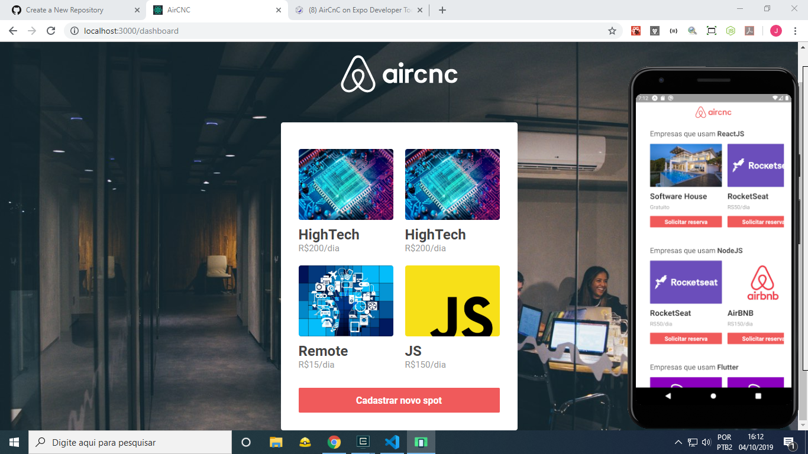

<h1>Aplicação desenvolvida na semana omnistack: AirCnc.</h1>
Utilizamos a stack <b>NodeJS, ReactJS</b> e <b>ReactNative.</b>
Construímos a <i>API</i> utilizando o NodeJS e um banco de dados NoSql(MongoDB) para servir o front-end tanto da web quanto do mobile.
Finalizamos o projeto com uma mensagem de requisição de agendamento em tempo real utilizando o <b>socket.io.</b>
<b>#Rocketseat<b>
<b>#NodeJS #ReactJS #ReactNative</b>

